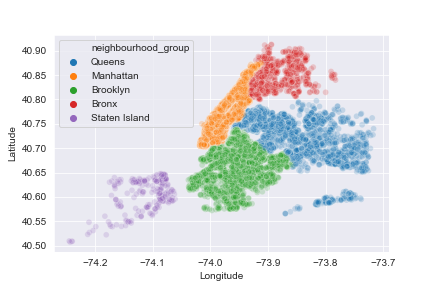
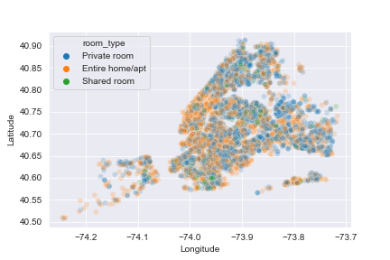
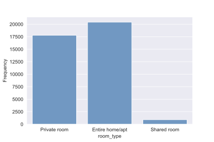
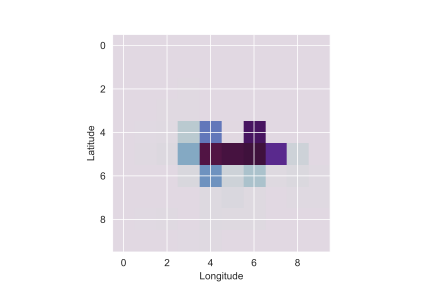

# AirBnB Price Prediction

## Problem Overview
The current competition is a regression problem based on the New York City Airbnb Open Data, a collection of Airbnb listings in New York City, for the year 2019. The goal of the competition is to predict the price for each insertion. The dataset we have been given was divided into two part:
* developement set : it contains 39,116 records with the price label
* evaluation set : it contains 9,779 records without the price label

So, we will use the development set for building the regression model, by considering its performance to varying of different hyperparameters. 
In order to avoid overfitting, we have to explore just the development set, because otherwise the model will not generalize enough. Firstly, it is important to understand the data we are dealing with.

The attributes `id` and `host_id` are incremental values that only identifies the listing and the host, whereas `name` and `host_name` are the related nominal variables. Then, there are 4 features that identify the location of the house. `neighbourhood` and `neighbourhood_group` identify a generic location. The first one is a generalization of second one, in fact there are 221 neighbourhoods and 5 neighbourhood groups: Brooklyn, Queens, Manhattan, Bronx and Staten Island. As it can be clearly seen in Figure 1, there is an overall homogeneous distribution of listing among these neighborhood groups, except for Staten Island that seems to have less apartments for rent. Then, `latitude` and `longitude` represents the exact location of the house.

Another categorical feature is `room_type` that is related to the kind of rent and it can be: `Entire home/apt`, `Private room` and `Shared room`. The first two categories are well distributed in New York City, whereas the last one is less common to see. Figure 2 shows the distribution of these three categories in the city and Figure 3 points out the difference among their frequencies.   

Figure 1 - Neighborhood Group           |  Figure 2 - Room Type
:-------------------------:|:-------------------------:
  |  

There are several other self explanatory attributes, such as `price` (per night), `minimum_nights`, `number_of_reviews`,  `last_review` (date) and `reviews_per_month`. These last three attributes present some null values, in fact if an apartment has no reviews, the attributes last review and the reviews per month will be null too. This issue will be managed during the preprocessing phase. Finally, there is `calculated_host_listings_count` that defines the number of listings for the current host and `availability_365` that represents the availability for the current year. It can be 0 and we can assume that it happens when the host set the house as "unavailable".

  

  

## Proposed Approach  
### Preprocessing
We assumed that name, host_name do not affect the price of a listing, even tho a consistent answer would require a proper text mining analysis. last_review is a date object and in this context it could be difficult to manage. So, as a first step, we dropped these three columns. Immediately after, we managed the null values on the reviews fields. In particular, since  null means that there are no reviews yet, a possible way to manage them is by fill these values with zero. 
  
Then, a critical issues regards the categorical values, in fact any regression model cannot manage nominal values. In particular we are talking about neighbourhood, neighbourhood_group and room_type. An encoding one to one is made by the factorize() method provided by pandas, that converts all the distinct strings into distinct values. In order to have a perfect correspondence among the evaluation set and the test set, we used that method on the concatenation of both evaluation and development set. After the encoding, it was possible to distinguish them because the evaluation set had null values on the price label. 
  
Finally, it was possible to look for the linear correlation for the price. As we may imagine, the feature that mostly affects the price is room_type. Notice that also a meaning value, for example the  longitude has a `linear correlation` of -0.148891. It means that the price has a slight tendency to go down when you go north. Table I defines in detail all the labels and their linear correlation. 

Actually I tried to drop the closest feature to 0, that was id, but we noticed an overall decline in performance, so we maintained the same structure without dropping any other column. 
  
| `Label`  | `Price Correlation` |
| ------------- | ------------- | 
| price | 1.000000 |  
| room_type | 0.204980 | 
| availability_365 | 0.082667 |  
| calculated_host_listings_count | 0.055070 | 
| minimum_nights | 0.044238 |  
| latitude | 0.031274 | 
| host_id | 0.015168 |  
| id |0.009273 | 
| neighbourhood |-0.013436|  
| number_of_reviews |-0.048254 | 
| neighbourhood_group |-0.049987  |
| reviews_per_month |-0.053285 |
| longitude |-0.148891 | 

### Model Selection
The following algorithms have been tested:
* `Linear Regression` : it is a model that assumes a linear relationship among its features. The prediction is made by computing a weighted sum of the input features and the intercept (formally called bias). 
* `Random Forest Regressor` : it is an ensemble of Decision Trees, each one trained with different records and features. It is not so interpretable as a decision tree because of its complexity, but it is much more accurate. In fact, by training several times the model with different features and informations, it is more probable that the noise as well as the overifitting will be reduced.

For both regressors, the best hyperparameters configurations was defined through a grid search, explained in detail in the  following section.
  
### Hyperparameters Tuning

There have been defined two sets of different hyperparameters, defined in Table II.
  
| `Model`  | `Hyperparameters` | `Values` |
| ------------- | ------------- | ------------- | 
| RandomForestRegressor | n_estimators   max_features |  {300,500,700}   {'auto', 'sqrt', 'log2'} |  
| LinearRegression | fit_intercept   normalize | {True, False}   {True, False} |  
  
The `grid search` trains the model with all the possible configurations and measure its performance by using the cross validation method. This method randomly split the entire dataset into k folds, train the model on k-1 folds and test it with the remaining one. This process is repeated until each fold has been tested. At the end of the process, it is possible to select the best configuration (the one that performs the best score) and use it for testing the evaluation test. 

## Results
The leaderboard was based on the `R2_score`, so we measured our performances with that one. The best configuration for \`LinearRegression` was {fit_intercept=True, normalize=False} and it achieved a result of `0.07815`. Instead, the `RandomForestRegressor` obtained an overall performance of `0.20900` with {max_features='sqrt', n_estimators=700}. 

The random forest outperformed the linear regression. Hence, we trained the random forest on the entire development set and we predicted the evaluation set label. The `public score obtained is 0.281`. In order to compare the hyperparemeters tuning and the feature selection phase, we trained the random forest with the `default` hyperparameters and it obtained a public score of `0.202`. 

Since the development and the evaluation set initially belonged to the same dataset, we can expect that both price distributions are quite similar over the plane (longitude,latitude). In fact, in Figure 4 there is the price distribution of the development set, and in Figure 5 there is the predicted price distribution from the evaluation set. It can be clearly seen that they are equal.  
  

Figure 1 - Price Distribution of Development set           |  Figure 2 - Price Distribution of Evaluation set
:-------------------------:|:-------------------------:
  |  
  
  
## Discussion
The current approach performed much better than the proposal naive solution with the default random forest or with a simple linear regression. Since we are dealing with continuous variables and a huge amount of parameters, it is quite improbable to reach such an accurate model. So the overall result can be considered a good one. 

In order to improve the current model, it would be appropriate to do some further analysis on the text fields, such as name and host_name. It would be interesting to find the most common words in the most reviewed listings and see if there could be a possible relationship among the name of a listing and its popularity, and as a side effect, a rise in the price. 
  
 
  
* Code : https://github.com/francescodisalvo05/airbnb-price-prediction/blob/main/airbnb-price-prediction.ipynb
